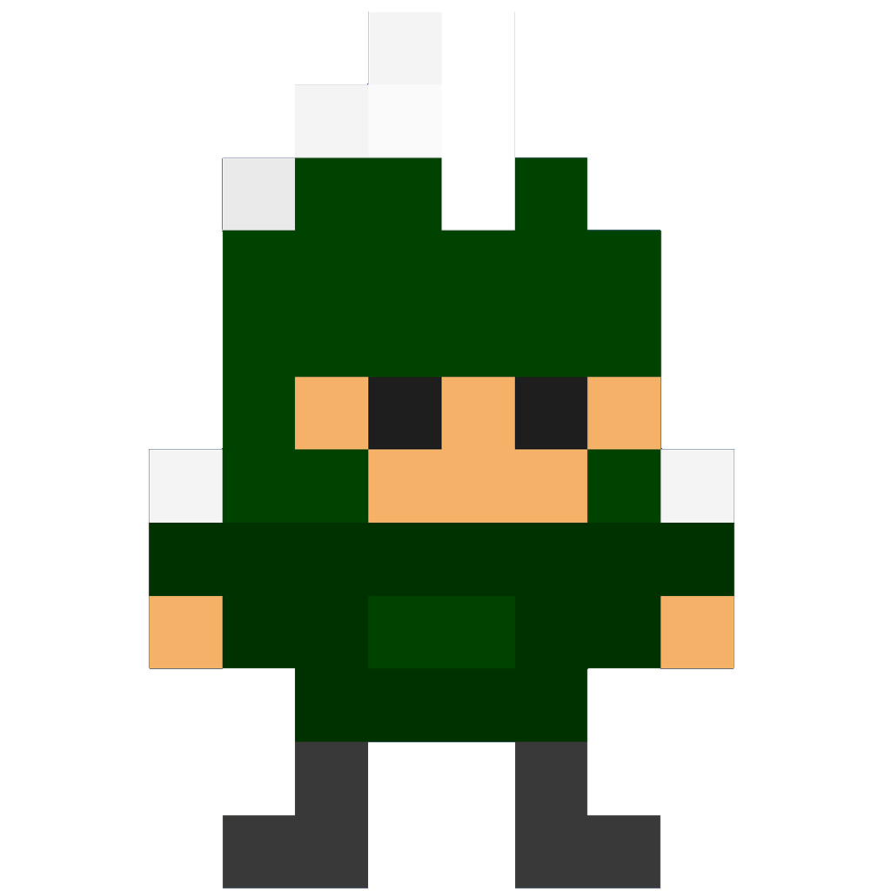

# Super-Sparty-Bros

  

## Overview

**Super-Sparty-Bros** is a 2D platformer game developed in Unity3D as part of my game development training. It showcases the skills I've learned throughout the course. The game is inspired by the classic *Super Mario Bros* game and serves as a final project for the course I attended.

 In this game, you control a character named **Sparty**, who must navigate through challenging levels, avoiding enemies, collecting coins and hearts, and progressing to the next level by 
 reaching the end of each stage. The project was developed as a demonstration of my understanding of 2D game mechanics, Unity3D game engine, and game design principles.

---
## Game Features
- **Character Control**: Players control Sparty, running, jumping, and avoiding enemies.
- **Enemies**: Several enemy types appear throughout the game, which Sparty must avoid.
- **Collectibles**: Coins and hearts are scattered around the levels, rewarding players for exploration.
- **Multiple Levels**: When Sparty reaches the end of a level, the player moves on to the next.
- **Inspired by Super Mario Bros**: The gameplay, art style, and level design take inspiration from the famous *Super Mario Bros* game.
---
## Development Tools & Technologies
- **Unity3D**: Main engine used to build the game, handle physics, and design the levels.
- **C#**: The scripting language used to create the game mechanics, player movements, and enemy AI.
- **2D Assets**: Designed using sprite sheets and tilemaps, implementing custom-made assets and free assets for the project.
---
## How to Play
1. **Run the Game** by visiting the link.
2. Hit play to start the game.
3. Control Sparty using the arrow keys (or assigned keys) to move and jump.
4. Avoid enemies, collect coins and hearts, and reach the end of the level to proceed.

## Game Link:

---
## Credits

A special thanks to my course instructor from the old Coursera **GAME DESIGN AND DEVELOPMENT** courses, which inspired and guided this project. The course provided the foundation of my skills and helped me bring **Super-Sparty-Bros** to life. Without the guidance from the instructor, this project would not have been possible.
- **Course**: Game Development for Modern Platforms by [Brian M. Winn] on Coursera
- **Developer**: [Izzat Kawadri]

  Thank you for checking out my project! I hope you enjoy playing **Super-Sparty-Bros**. If you have any feedback or suggestions, feel free to reach out.
